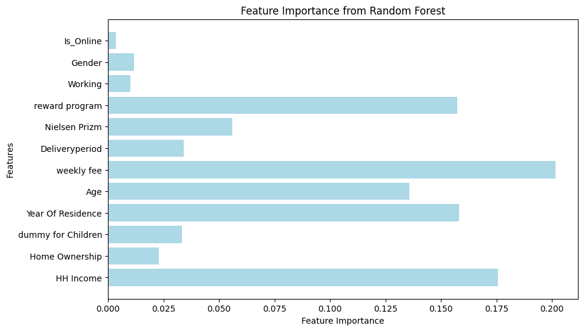

# SK 네트웍스 Family AI 캠프 11기 2차 프로젝트
 

# INTRODUCTION TEAM
## 팀 이름: Team Rabbit

| 김형주 | 신진슬 | 오정현 | 황준호 |
|--------|--------|--------|-------|
|  |  |  |  |

 

# INTRODUCTION PROJECT

## 🚗프로젝트 명: 신문 구독 서비스  

#### 🗓️ 개발 기간
2025.03.31 ~ 2025.04.01 (총 2일)

### 🐉 프로젝트 설명

<figure  style="text-align: center; height:250px; width:400px;">

</figure>

### 🚗 프로젝트 필요성
디지털 전환과 미디어 경쟁 심화로 신문사 구독자 유지가 어려워지고 있습니다. 특히, 온라인·오프라인 고객의 이탈 원인이 복합적이어서 간단한 통계 분석만으로는 정확한 예측이 어렵습니다.  
머신러닝 기반 이탈 예측 모델을 구축하면, 고객의 다양한 행동 패턴과 복합적인 이탈 원인을 반영해 고객별 이탈 가능성을 조기에 식별하고, 구독 연장 혜택 등의 사전 대응 전략을 마련할 수 있습니다. 

### ✅ 프로젝트 목표
머신러닝을 활용하여 신문사 고객의 이탈 가능성을 식별하고, 이를 바탕으로 이탈률을 낮춰 수익을 최대화하는 것이 목표입니다.
 

 

# ⚒️Tech Stack
## 주요 기술
> 개발 환경 및 도구

|||||
|:---:|:---:|:---:|:---:|

> 모델 구현

 

# WBS
| 작업명              | 시작일  | 종료일  | 담당자 | 산출물              |
|---------------------|---------|---------|--------|---------------------|
| 프로젝트 주제선정   | 03-31   | 03-31   |  ALL   |    데이터셋     |
| EDA작성            | 03-31  | 03-31  |   ALL     |    전처리 후 데이터셋    |
| 모델 선정  | 03-31  | 03-31  |   ALL   | - |
| 모델 성능평가      | 03-31  | 03-31  |   ALL     |     -    |
| README 작성  | 03-31  | 03-31  |   ALL     |     README      |
| 발표      | 03-31  | 03-31  |    황준호    | 결과 | 
&nbsp;

| **번호** | **모델명**                      | **담당자** |
|----------|---------------------------------|------------|
| 1        | **로지스틱 회귀** (Logistic Regression) | 형주       |
| 2        | **K-최근접 이웃** (KNN)         | 형주       |
| 3        | **의사결정나무** (Decision Tree) | 진슬       |
| 4        | **랜덤 포레스트** (Random Forest) | 진슬       |
| 5        | **XGBoost**                         | 준호       |
| 6        | **서포트 벡터 머신** (SVM)      | 준호       |
| 7        | **다층 퍼셉트론** (MLPClassifier) | 정현       |
| 8        | **보팅 분류기** (Voting Classifier) | 정현       |

 

# EDA

## 히트맵 
  

## 변수 간 상관관계 분석

### 주요 상관관계
- **Weekly Fee ↔ Delivery Period** (상관계수: 0.37)  
  - 주간 요금과 배송 기간 사이에 양의 상관관계가 존재.  
  - 👉 배송 주기가 길수록 요금이 증가하는 경향.

- **Year Of Residence ↔ Age** (상관계수: 0.35)  
  - 거주 기간과 나이 사이에 양의 상관관계가 존재.  
  - 👉 연령이 높을수록 거주 기간이 길어지는 경향.

- **Working ↔ Nielsen Prizm** (상관계수: -0.41)  
  - 특정 Nielsen Prizm 코드일 때 비근로자일 확률이 높음.  
  - 👉 Working(1)과 특정 고객 유형 간 반비례 관계.

---

### 상관관계가 거의 없는 변수
- **Is_Online**  
  - 대부분의 변수와 상관성이 낮아, 온라인 구독 여부가 다른 변수와 큰 연관성이 없음.

- **Gender**  
  - 대부분의 변수와 상관계수가 낮아, 성별이 구독 여부에 직접적인 영향을 미치지 않음.

  

# 시각화

### 이탈 여부 분포

- No(이탈자)가 Yes(구독자)보다 약 4배 많으며, 클래스 불균형이 확인됨.   

### 카테고리별 이탈 비율

- 집을 소유한 고객보다 임차 고객의 이탈률이 높았으며, 매일 배송을 신청한 고객이 이탈률이 가장 낮음.
   

### 연속형 변수 시각화

- 주간 요금이 낮을수록 고객이 이탈할 가능성이 높아 보임
- 가구 소득은 이탈 여부와 큰 차이를 보이지 않음.
- 나이가 많은 고객들은 구독을 유지하는 경향이 강하며, 젊은 층에서 이탈 가능성이 높음.

### 고객 유형 분포

- 남성과 여성 간의 이탈률 차이가 거의 없음
- 비근로자 그룹은 근로자 그룹보다 약간 더 높은 이탈 가능성을 보임

  

# 전처리 후 컬럼
| **Number** | **Column**            | **Meaning**                                     | **Preprocessing**                                                                 |
|------------|-----------------------|-------------------------------------------------|----------------------------------------------------------------------------------|
| 1          | HH Income             | 가구 소득                                       | 소득 범위 데이터(`$30,000 - $39,999`)를 평균값으로 변환 |
| 2          | Home Ownership        | 주택 소유 여부                                  | 'OWNER'는 1, 'RENTER'는 0                                               |
| 3          | dummy for Children    | 자녀 유무                                       | 자녀가 있으면 1, 없으면 0                                                |
| 4          | Age range             | 연령대 범위                                     | 범위 데이터를 평균값으로 (예: "30-40" -> 35)                                |
| 5          | weekly fee            | 주간 요금                                       | 범위 데이터를 평균값으로 (예: "$10-$15" -> 12.5)                           |
| 6          | Deliveryperiod        | 배송 주기                                       | 온라인 배송 여부와 배송 주기를 매핑 (예: '7Day' -> 7일)               |
| 7          | Nielsen Prizm         | Nielsen 프리즘 그룹                            | 남(0),여(1) & 비근로자(0),근로자(1)                                |
| 8          | reward program        | 리워드 프로그램 참여 횟수                     | 1 이상은 1, 그 외에는 0으로 변환                                               |
| 9          | Subscriber            | 구독 여부                                       | 'YES'는 0, 'NO'는 1 변환                                                     |

 

# 학습 분석
## 모델 성능 비교표 

| 모델                          | Precision (Class `0`) | Recall (Class `0`) | F1 Score (Class `0`) | Precision (Class `1`) | Recall (Class `1`) | F1 Score (Class `1`) |
|------------------------------|-----------------------|--------------------|----------------------|-----------------------|--------------------|----------------------|
| 로지스틱 회귀 (Cost-Sensitive) | 0.69                  | 0.67               | 0.68                 | 0.68                  | 0.69               | 0.69                 |
| KNN                          | 0.79                  | 0.81               | 0.80                 | 0.80                  | 0.79               | 0.80                 |
| 랜덤 포레스트 (Cost-Sensitive) | 0.90                  | 0.87               | 0.88                 | 0.87                  | 0.90               | 0.89                 |
| XGBoost (Cost-Sensitive)     | 0.98                  | 0.79               | 0.87                 | 0.82                  | 0.98               | 0.89                 |
| MLP (Cost-Sensitive)         | 0.83                  | 0.79               | 0.81                 | 0.79                  | 0.84               | 0.82                 |
| SVM (Cost-Sensitive)         | 0.76                  | 0.71               | 0.74                 | 0.73                  | 0.77               | 0.75                 |

#### MLP 코드
 
  

#### SVM 코드
  
  

#### LigthGBM 코드
  
  

## 모델 성능 비교표 - Faker 데이터 증강 후

| 모델                          | Precision (Class `0`) | Recall (Class `0`) | F1 Score (Class `0`) | Precision (Class `1`) | Recall (Class `1`) | F1 Score (Class `1`) |
|------------------------------|-----------------------|--------------------|----------------------|-----------------------|--------------------|----------------------|
| 로지스틱 회귀 (Cost-Sensitive) | 0.82                  | 0.71               | 0.76                 | 0.74                  | 0.85               | 0.79                 |
| KNN                          | 0.86                  | 0.78               | 0.82                 | 0.79                  | 0.87               | 0.83                 |
| 랜덤 포레스트 (Cost-Sensitive) | 0.91                  | 0.83               | 0.87                 | 0.84                  | 0.91               | 0.88                 |
| XGBoost (Cost-Sensitive)     | 0.96                  | 0.79               | 0.86                 | 0.82                  | 0.97               | 0.89                 |
| MLP (Cost-Sensitive)         | 0.89                  | 0.78               | 0.83                 | 0.80                  | 0.91               | 0.85                 |
| SVM (Cost-Sensitive)         | 0.90                  | 0.76               | 0.82                 | 0.79                  | 0.92               | 0.85                 |

  

# 최종 모델 선정 - Random Forest

  랜덤 포레스트는 다른 모델보다 전반적으로 균형 잡힌 성능을 보여 선택했습니다. 
- **클래스 0과 1 모두에서 우수한 F1 Score** : (Class 0: 0.87, Class 1: 0.88)  
- **높은 Recall과 Precision** : 이탈 고객과 유지 고객 모두를 효과적으로 탐지  
- **우수한 ROC AUC** : 0.94

## 변수 중요도 분석 결과

### 주요 변수
- **Weekly Fee**: 중요도 20%  
  - 구독 여부 예측에서 가장 큰 영향력을 가지는 변수.

- **HH Income**: 중요도 18%  
  - 가구 소득이 구독 여부에 큰 영향을 미침.

- **Reward Program**: 중요도 16%  
  - 리워드 프로그램 참여가 구독 유지의 핵심 요인.

- **Age, Year Of Residence**: 중요도 약 10%  
  - 나이와 거주 연수가 구독 여부와 일정 부분 연관됨.

---

### 중요도가 낮은 변수
- **Is_Online, Working, Gender**  
  - 구독 여부를 예측하는 데 상대적으로 낮은 중요도를 보임.    

## 💡 최종 인사이트 요약

- **구독 여부에 가장 영향을 미치는 변수:**  
  - `weekly fee`, `HH Income`, `reward program`  
  - 요금이 높거나 리워드 프로그램 참여 시 구독 가능성 증가  
  - 특히 `weekly fee`의 중요도가 가장 큼 → 가격 정책 중요  

- **고연령층 특징:**   
  - 나이와 거주 연수는 양의 상관관계 → 장기 거주 고령층의 구독 가능성 증가  

- **중요도가 낮은 변수:**  
  - `Is_Online`, `Gender` → 구독 여부 예측에 영향 적음  
  - 온라인 구독 여부나 성별 기반 전략은 효과 제한적  

 

## 📌 전략 제안

### 1. **가격 전략 강화**  
- `weekly fee` 영향이 크므로 할인 정책 및 다양한 요금제 제공  

### 2. **리워드 프로그램 개선**  
- 적립 포인트 증가, 구독 유지 보상 프로그램 도입  

### 3. **고연령층 타겟팅**  
- 장기 거주 고령층 대상 장기 구독 혜택 제공  

### 4. **비근로자 및 특정 그룹 대상 프로모션**  
- 비근로자(예: 학생, 은퇴자) 맞춤형 할인 요금제 및 콘텐츠 제공  

  

# 😐한 줄 회고
- 김형주:데이터 불균형으로 여러 어려움을 겪었지만, 이를 통해 여러 가지 방법을 사용해보며 공부 할 수 있는 유익한 시간이었습니다.

- 신진슬:데이터 불균형 문제를 해결하는 과정이 쉽지 않았지만, 이를 통해 모델 성능 개선의 중요성을 다시 한번 느낄 수 있었습니다.

- 오정현:클래스 불균형이 모델 성능에 미치는 영향을 확인할 수 있었고, SMOTE와 Faker를 활용하여 여러 해결 방법을 탐색할 수 있는 유익한 시간이었습니다.

- 황준호: 아무리 열심히 튜닝을해도 데이터가 따라 주지 않으면 소용 없는다는 것을 다시 한번 뼈저리게 느꼈다. 머신러닝, 딥러닝에서 모델도 중요하지만 모델 보다 중요한게 데이터라고 생각합니다
