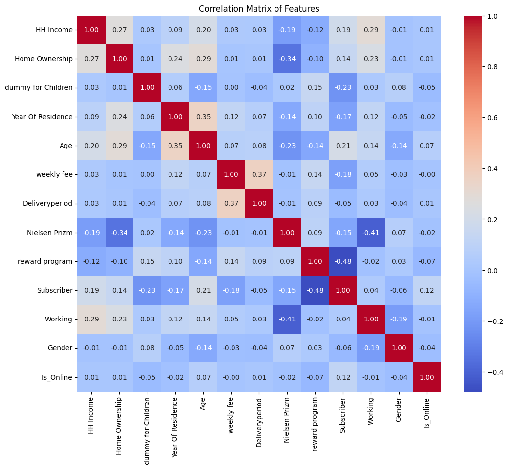

# SK 네트웍스 Family AI 캠프 11기 2차 프로젝트
 

# INTRODUCTION TEAM
## 팀 이름

| 김형주 | 신진슬 | 오정현 | 황준호 |
|--------|--------|--------|-------|
|  |  |  |  |

 

# INTRODUCTION PROJECT

## 🚗프로젝트 명: 신문 구독 서비스  

#### 🗓️ 개발 기간
2025.03.31 ~ 2025.04.01 (총 2일)

g
### 🐉 프로젝트 설명

<figure  style="text-align: center; height:250px; width:400px;">

</figure>

### 🚗 프로젝트 필요성
디지털 전환과 미디어 경쟁 심화로 신문사 구독자 유지가 어려워지고 있습니다. 특히, 온라인·오프라인 고객의 이탈 원인이 복합적이어서 간단한 통계 분석만으로는 정확한 예측이 어렵습니다.  
머신러닝 기반 이탈 예측 모델을 구축하면, 고객의 다양한 행동 패턴과 복합적인 이탈 원인을 반영해 고객별 이탈 가능성을 조기에 식별하고, 구독 연장 혜택 등의 사전 대응 전략을 마련할 수 있습니다. 

### ✅ 프로젝트 목표
머신러닝을 활용하여 신문사 고객의 이탈 가능성을 식별하고, 이를 바탕으로 이탈률을 낮춰 수익을 최대화하는 것이 목표입니다.
 

 

# ⚒️Tech Stack
## 주요 기술
> 개발 환경 및 도구

|||||
|:---:|:---:|:---:|:---:|

> 모델 구현

 

# WBS
| 작업명              | 시작일  | 종료일  | 담당자 | 산출물              |
|---------------------|---------|---------|--------|---------------------|
| 프로젝트 주제선정   | 03-31   | 03-31   |  ALL   |                     |
| EDA작성            | 03-31  | 03-31  |   ALL     | 없음               |
| 모델 선정  | 03-31  | 03-31  |   ALL   |  |
| 모델 성능평가      | 03-31  | 03-31  |   ALL     |          |
| README 작성  | 03-31  | 03-31  |   ALL     |           |
| 발표         | 03-31  | 03-31  |    황준호    | 결과               |

| **번호** | **모델명**                      | **담당자** |
|----------|---------------------------------|------------|
| 1        | **로지스틱 회귀** (Logistic Regression) | 형주       |
| 2        | **K-최근접 이웃** (KNN)         | 형주       |
| 3        | **의사결정나무** (Decision Tree) | 진슬       |
| 4        | **랜덤 포레스트** (Random Forest) | 진슬       |
| 5        | XGBoost                         | 준호       |
| 6        | **서포트 벡터 머신** (SVM)      | 준호       |
| 7        | **다층 퍼셉트론** (MLPClassifier) | 정현       |
| 8        | **보팅 분류기** (Voting Classifier) | 정현       |

 

# EDA

## 히트맵 & 그래프
  

### 상관관계 분석 결과

#### 주요 상관관계

- **Weekly Fee ↔ Delivery Period** (0.65)  
  - 요금이 높은 고객은 주간 또는 매일 배달을 선택하는 경향이 큼.  
  - 👉 **고가 요금제 + 고빈도 배송 서비스 상품** 제안.

- **Home Ownership ↔ Year Of Residence** (0.44)  
  - 집을 소유한 고객은 장기 거주 가능성이 높음.  
  - 👉 **주택 소유자 대상 장기 구독 할인 정책** 추천.

- **Age ↔ Year Of Residence** (0.60)  
  - 나이가 많을수록 장기 거주 경향이 있음.  
  - 👉 **고령층 맞춤형 장기 계약 서비스** 제안.

- **Gender ↔ Working** (-0.22)  
  - 남성 근로자 비율이 조금 더 높음.  
  - 👉 **직장인 대상 조간 신문 구독 캠페인** 필요.

### 변수 중요도 분석 결과 - Random Forest

- **Weekly Fee**: 고객 이탈 여부에 가장 큰 영향을 미치는 변수
- **Nielsen Prizm**: 고객 유형 코드로, 두 번째로 중요한 변수
- **Year Of Residence**: 거주 연수가 세 번째로 중요한 변수
- **Age**: 나이 역시 중요한 변수로 확인
- **HH Income**: 가구 소득도 일정한 영향을 미치는 변수

### 이탈 여부 분포

- No(이탈자)가 Yes(구독자)보다 약 4배 많으며, 클래스 불균형이 확인됨.   

### 카테고리별 이탈 비율

   

### 연속형 변수 시각화

- 주간 요금이 낮을수록 고객이 이탈할 가능성이 높아 보임
- 가구 소득은 이탈 여부와 큰 차이를 보이지 않음.
- 나이가 많은 고객들은 구독을 유지하는 경향이 강하며, 젊은 층에서 이탈 가능성이 높음.

### 고객 유형 분포

- 남성과 여성 간의 이탈률 차이가 거의 없음
- 비근로자 그룹은 근로자 그룹보다 약간 더 높은 이탈 가능성을 보임

 

# 전처리 후 컬럼
| **Number** | **Column**            | **Meaning**                                     | **Preprocessing**                                                                 |
|------------|-----------------------|-------------------------------------------------|----------------------------------------------------------------------------------|
| 1          | HH Income             | 가구 소득                                       | 소득 범위 데이터(`$30,000 - $39,999`)를 평균값으로 변환 |
| 2          | Home Ownership        | 주택 소유 여부                                  | 'OWNER'는 1, 'RENTER'는 0                                               |
| 3          | dummy for Children    | 자녀 유무                                       | 자녀가 있으면 1, 없으면 0                                                |
| 4          | Age range             | 연령대 범위                                     | 범위 데이터를 평균값으로 (예: "30-40" -> 35)                                |
| 5          | weekly fee            | 주간 요금                                       | 범위 데이터를 평균값으로 (예: "$10-$15" -> 12.5)                           |
| 6          | Deliveryperiod        | 배송 주기                                       | 온라인 배송 여부와 배송 주기를 매핑 (예: '7Day' -> 7일)               |
| 7          | Nielsen Prizm         | Nielsen 프리즘 그룹                            | 남(0),여(1) & 비근로자(0),근로자(1)                                |
| 8          | reward program        | 리워드 프로그램 참여 횟수                     | 1 이상은 1, 그 외에는 0으로 변환                                               |
| 9          | Subscriber            | 구독 여부                                       | 'YES'는 0, 'NO'는 1 변환                                                     |

 

# 인공지능 학습 결과서

## 모델 성능 비교표

| 모델                          | Precision (Class `0`) | Recall (Class `0`) | F1 Score (Class `0`) | Precision (Class `1`) | Recall (Class `1`) | F1 Score (Class `1`) |
|------------------------------|-----------------------|--------------------|----------------------|-----------------------|--------------------|----------------------|
| 로지스틱 회귀 (Cost-Sensitive) | 0.69                  | 0.67               | 0.68                 | 0.68                  | 0.69               | 0.69                 |
| KNN                          | 0.79                  | 0.81               | 0.80                 | 0.80                  | 0.79               | 0.80                 |
| 랜덤 포레스트 (Cost-Sensitive) | 0.90                  | 0.87               | 0.88                 | 0.87                  | 0.90               | 0.89                 |
| XGBoost (Cost-Sensitive)     | 0.98                  | 0.79               | 0.87                 | 0.82                  | 0.98               | 0.89                 |
| MLP (Cost-Sensitive)         | 0.83                  | 0.79               | 0.81                 | 0.79                  | 0.84               | 0.82                 |
| SVM (Cost-Sensitive)         | 0.76                  | 0.71               | 0.74                 | 0.73                  | 0.77               | 0.75                 |

 

# 수행 결과

 

# 한 줄 회고
